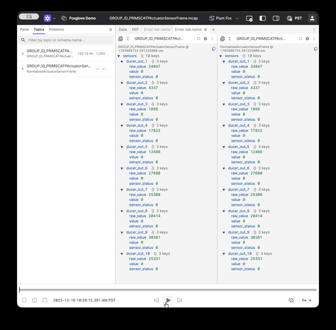

# Convert Null to Zeros for Nested Messages

A reference implementation for converting `null` values in protobuf messages to zero-filled default values to prevent message content from "snapping" in [Foxglove](https://app.foxglove.dev/).




Before (left) | After (right)

## Problem Statement

During protobuf to JSON decoding, protobuf does not make a distinction between `null` and zero-filled values. This leads to sub-messages being dropped from the JSON representation when they contain only default/zero values. When users read the raw messages in [Foxglove](https://foxglove.dev), the content keeps "snapping" (appearing and disappearing) due to the inconsistent presence of sub-messages.

For example, a message with `ducer_out_1: null` will be missing that field entirely in JSON, while a message with `ducer_out_1: { raw_value: 0, value: 0, sensor_status: 0 }` will include the field. This inconsistency causes visualization issues.

## Solution Overview

This Foxglove extension converts `null` values to desired default sub-message values (zero-filled in this case) and publishes the normalized messages to a new topic. By subscribing to this converted topic in the Raw message panel, users get consistent message structure with all fields always present.

The extension:
- Subscribes to the input topic: `GROUP_ID_PRIMSCATPActuatorSensorFrame`
- Converts any `null` sensor values to default zero-filled `SensorData` objects
- Publishes normalized messages to: `GROUP_ID_PRIMSCATPActuatorSensorFrame/show_nulls_as_zeros`

## Project Structure

```
proto-null-to-zero-fill/
├── src/
│   └── index.ts              # Main extension code - topic converter logic
├── dist/
│   └── extension.js          # Compiled extension (generated)
├── gen_fake_ducer_out.py     # Script to generate test MCAP file with null values
├── package.json              # Node.js dependencies and scripts
├── tsconfig.json             # TypeScript configuration
├── CHANGELOG.md              # Version history
└── README.md                 # This file
```

## Test Data Generation

Since customer data could not be shared, the `gen_fake_ducer_out.py` script generates a 10-second MCAP file with random `ducer_out_N = null` values to replicate customer behavior.

**To generate test data:**

```bash
python3 gen_fake_ducer_out.py
```

This creates `GROUP_ID_PRIMSCATPActuatorSensorFrame.mcap` with:
- 10 seconds of data at 120 Hz (1200 messages total)
- 10 sensors (`ducer_out_1` through `ducer_out_10`)
- 10% probability that any sensor will be `null` in each message

## Usage

### Step 1: Customize the Extension (Optional)

If you need to adapt this for different topics or default values, modify `src/index.ts`:

1. **Change input/output topics:**
   ```typescript
   inputTopics: ["YOUR_INPUT_TOPIC"],
   outputTopic: "YOUR_INPUT_TOPIC/show_nulls_as_zeros",
   ```

2. **Modify default sensor data:**
   ```typescript
   // Your default values
   const DEFAULT_SENSOR_DATA: SensorData = {
     raw_value: 0,
     value: 0,
     sensor_status: 0,
   };
   ```

3. **Update schema description** if your message structure differs

### Step 2: Build and Install the Extension

1. Build and install the extension:
   ```sh
   npm run build
   npm run local-install
   ```

2. Open Foxglove Desktop (or refresh with `Ctrl+R` / `Cmd+R`)

3. The extension will automatically convert messages

### Step 3: Visualize in Foxglove Studio

1. Open your `.mcap` file in Foxglove Studio (or connect to your data source)

2. Add the **Raw message** panel to your layout

3. Subscribe to the converted topic: `GROUP_ID_PRIMSCATPActuatorSensorFrame/show_nulls_as_zeros`

4. Compare with the original topic to see the difference - the converted topic will have consistent structure with all sensors always present

## References

- [Foxglove Extensions Documentation](https://docs.foxglove.dev/docs/visualization/extensions/introduction)
- [Create Topic Converter Guide](https://docs.foxglove.dev/docs/extensions/guides/create-topic-converter)